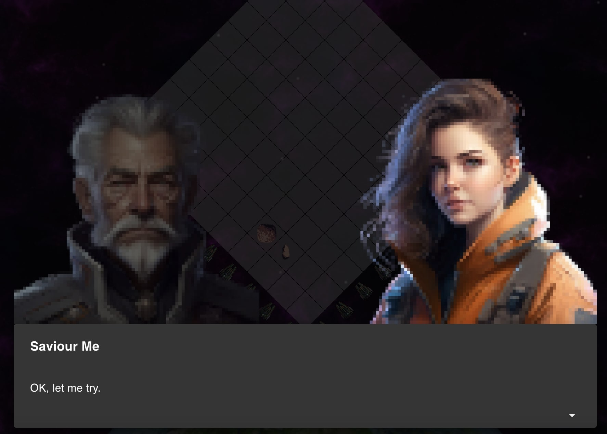

# React Game Dialog

[Demo](https://singerattack.chunlaw.io/)

<p align="center">
  
</p>

The react package is to provide a component to transform Markdown to game dialogs. It is a must to use [Material UI](https://mui.com) to make the component function normallly.

# Installation

```
yarn add react-game-dialog
```
or
```
npm install react-game-dialog
```

# Example Usage

Before using the component, you might do the following:

```typescript
// main.tsx
import React from "react";
import ReactDOM from "react-dom/client";
import { CssBaseline, ThemeProvider, createTheme } from "@mui/material";
import GameDialogue from "react-game-dialog";

const theme = createTheme({
  palette: {
    mode: "dark",
  },
});

ReactDOM.createRoot(document.getElementById("root")!).render(
  <React.StrictMode>
   {/* it is important to setup the ThemeProvider before using <GameDialog /> */}
    <ThemeProvider theme={theme}>
      <CssBaseline />
      <App />
    </ThemeProvider>
  </React.StrictMode>
);
```

To use the component, 

```typescript
// App.tsx
import GameDialog from "react-game-dialog";
import { useState } from "react";

const App = () => {
  const [open, setOpen] = useState<boolean>(true)

  return (
    <GameDialog
      open={open}
      onClose={() => setOpen(false)}
      dialogues={[
        "### Peter\n\nHello, Amy!",
        "### Amy\n<!-- __ALIGN_RIGHT__ -->\n\nHow are you, Peter!",
      ]}
      characterUrls={{
        "Peter": "/assets/peter.png",
        "Amy": "assets/amy.png",
      }}
    />
  )
}

```

# Attributions

Character Artwork in the example by [Corax Digital Art](https://linktr.ee/coraxdigitalart)